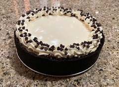

~~~ markdown-script
include '../markdownBookRecipe.bare'
recipeMenu()
~~~

# Bailey's Chocolate Chip Cheesecake

~~~ markdown-script
recipeHeader()
~~~

Using a Cuisinart, process 1 9 oz pkg chocolate wafer cookies to crumbs. Then add and process:

~~~ markdown-script
recipeIngredients(arrayNew( \
    '3 Tbsp sugar', \
    '6 Tbsp softened butter' \
))
~~~

Press the mixture on the bottom and 1/2 way up the sides of a 9 1/2 " spring form pan. Refrigerate
at least ten minutes until filling is ready. I use a flat tipped spoon the even the top of the
sides.

Wipe the crumb mixture out of the cuisinart workbowl before preparing the filling. Add to the bowl
and process:

~~~ markdown-script
recipeIngredients(arrayNew( \
    '3 pkgs (8 oz ea) softened cream cheese', \
    '1 C sugar', \
    '3 large eggs', \
    "3 Tbsp Bailey's Irish Cream liquor", \
    '3 Tbsp dark rum' \
))
~~~

Remove the work bowl from the Cuisinart and stir in the mini chocolate chips.

~~~ markdown-script
recipeIngredients(arrayNew( \
    '1 1/2 C mini chocolate chips' \
))
~~~

Pour the filling evenly into the chilled crust and bake at 350 degrees for 40 minutes. I clad the
bottom of the pan with foil to prevent butter from the crust from leaking onto the oven floor.
Remove from the oven and let cool for 15 minutes.

Prepare the topping by stirring together:

~~~ markdown-script
recipeIngredients(arrayNew( \
    '1 C sour cream', \
    '2 Tbsp sugar', \
    "1 Tbsp Bailey's" \
))
~~~

Spread evenly over the top of the cheesecake bake at 425 degrees for 10 minutes. Cool completely
before refrigerating. When ready to serve, carefully run a thin bladed knife around the edge of the
spring form pan before unhinging it. I usually pipe the top edge of the cake with whipped cream and
sprinkle the piping with more mini chocolate chips.

~~~ markdown-script
recipeIngredients(arrayNew( \
    '1/2 C mini chocolate chips' \
))
~~~

Like all cheesecake this is better if made a day ahead.
