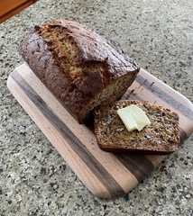

~~~ markdown-script
include '../markdownBookRecipe.mds'
recipeMenu()
~~~

# Banana Nut Bread

~~~ markdown-script
recipeHeader(objectNew( \
    'author', 'Merlin Salter' \
))
~~~

Cream together:

~~~ markdown-script
recipeIngredients(arrayNew( \
    '1/2 C butter', \
    '1 C sugar' \
))
~~~

Add and beat in:

~~~ markdown-script
recipeIngredients(arrayNew( \
    '2 eggs', \
    '4 Tbsp sour milk*', \
    '3 mashed ripe bananas' \
))
~~~

Add and stir in:

~~~ markdown-script
recipeIngredients(arrayNew( \
    '2 C flour', \
    '1 tsp baking soda', \
    '1/2 C chopped pecans' \
))
~~~

Turn the batter into a buttered glass loaf pan and bake in a 350 degree for 1 hour or until a
toothpick inserted in the center comes out clean. Cool the bread in the pan for 10 to 15 minutes,
then loosen the edges with a knife blade and turn out onto a cutting board and continue to cool or
slice and serve.

\* Mix the milk and the white vinegar (I'm convinced that this step is what makes this banana bread
so great. Use vinegar, not lemon juice.)

~~~ markdown-script
recipeIngredients(arrayNew( \
    '4 Tbsp milk', \
    '2 tsp white vinegar' \
))
~~~

I sometimes double the recipe and freeze the second loaf.
