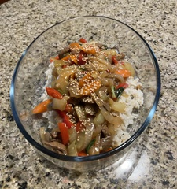

~~~ markdown-script
include '../markdownBookRecipe.mds'
recipeMenu()
~~~

# Beef Stirfry

~~~ markdown-script
recipeHeader()
~~~

Mix together marinade:

~~~ markdown-script
recipeIngredients( \
    '2 cloves crushed garlic', \
    '2 Tbsp soy sauce', \
    '1 Tbsp dry sherry', \
    '1 Tbsp cornstarch', \
    '3/4 tsp ground, dry ginger', \
    '8 oz lean, trimmed beef sirloin, sliced thinly' \
)
~~~

Add the beef and allow to marinade and let sit for at least 1/2 hour or up to 2 hours.

Cook the white rice per package directions.

~~~ markdown-script
recipeIngredients( \
    '1 c white rice' \
)
~~~

Prepare the vegetables as follows:

~~~ markdown-script
recipeIngredients( \
    '1 large stalk broccoli, cut into small florets (stalk can be peeled and sliced into 1/4" pieces)', \
    '1/2 sweet red pepper, julienned', \
    '1/2 yellow pepper, julienned', \
    '1 small onion, julienned', \
    '2 cloves garlic, thinly sliced crosswise' \
)
~~~

Drain (discard marinade) and stirfry beef strips in a large skillet with the vegetable oil until
browned. Set aside. Stirfry vegetables until tender crisp. Add back the beef and one can drained
water chestnuts.

~~~ markdown-script
recipeIngredients( \
    '1 Tbsp vegetable oil' \
)
~~~

Mix to together sauce as follows and add to the pan. Stir and cook just until sauce thickens.

~~~ markdown-script
recipeIngredients( \
    '1 Tbsp oyster sauce', \
    '3/4 C beef stock', \
    '1 Tbsp cornstarch dissolved in 2 Tbsp water', \
    '1 Tbsp soy sauce', \
    '1/4 tsp ground dry ginger' \
)
~~~

Serve over hot, cooked rice with toasted sesame seeds.
