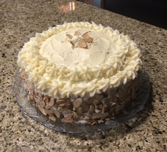

~~~ markdown-script
include '../markdownBookRecipe.mds'
recipeMenu()
~~~

# Carrot Cake With Lemon Frosting

~~~ markdown-script
recipeHeader()
~~~

Still Teresa's favorite birthday cake!

Prepare three 9" cake pans by buttering them and lining the bottoms with parchment paper also
buttered.

~~~ markdown-script
recipeIngredients( \
    '1 pound of carrots' \
)
~~~

Peel and slice the carrots and then cook in sauce pan with about an inch of salted water until
tender. Puree the drained carrots with a couple of tablespoons of the cooking liquid in a Cuisinart.
Turn the pureed carrots into a large bowl to cool.

When cool add and whisk in:

~~~ markdown-script
recipeIngredients( \
    '4 beaten eggs', \
    '1 Tbsp vanilla extract', \
    '1 8 oz can of crushed unsweetened pineapple, drained', \
    '1 C vegetable oil' \
)
~~~

Add to the above and stir in by hand:

~~~ markdown-script
recipeIngredients( \
    '3 C flour', \
    '2 1/2 C sugar', \
    '1 Tbsp cinnamon', \
    '1 Tbsp baking soda', \
    '1 tsp salt', \
    '1 1/2 C chopped pecans', \
    '3/4 C chopped raisins' \
)
~~~

Turn the batter evenly into the three greased, parchment lined 9” cake pans and bake at 350 degrees
for 35 minutes until a toothpick inserted into the center comes out clean. Cool the cakes in the
pans on a rack.

Frost with:

~~~ markdown-script
recipeIngredients( \
    '1 lb cream cheese at room temperature', \
    '2 1/2 sticks of butter at room temperature', \
    '1 Tbsp lemon Juice', \
    '2 tsp vanilla extract', \
    '5 2/3 C sifted confectioners sugar' \
)
~~~

Beat until light and fluffy, then chill until firm but spreadable (about an hour). Frost the cake
and then coat the sides with toasted sliced almonds. Refrigerate until 1 hour before serving.

~~~ markdown-script
recipeIngredients( \
    '2 C toasted sliced almonds' \
)
~~~
