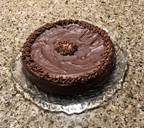

~~~ markdown-script
include '../markdownBookRecipe.bare'
recipeMenu()
~~~

# Chocolate Decadence

~~~ markdown-script
recipeHeader()
~~~

Melt the dark sweet chocolate (or use semi-sweet), sugar, and butter in a double boiler.

~~~ markdown-script
recipeIngredients([ \
    '1 1/4 lb dark sweet chocolate', \
    '1 Tbsp of sugar (if using semi-sweet chocolate)', \
    '10 Tbsp butter' \
])
~~~

Using a wire whisk beat the eggs and sugar together in a medium bowl over boiling water until the
sugar is dissolved and the mixture is warm to the touch. Now use an electric mixer to beat the eggs
until triple in volume (about 5 to 10 minutes).

~~~ markdown-script
recipeIngredients([ \
    '5 eggs', \
    '1 Tbsp sugar' \
])
~~~

Fold in the flour and the melted chocolate into the egg mixture.

~~~ markdown-script
recipeIngredients([ \
    '1 Tbsp flour' \
])
~~~

Pour the batter into an 8" round cake pan that has been buttered and lined with parchment (bottom
and 1/2" inch up the sides). Bake at 425 degrees for 15 minutes only. Allow the cake to cool, then
wrap with saran and freeze for 24 hours. When ready to serve, thaw, and remove the cake to a serving
plate and glaze.

### Chocolate Glaze

~~~ markdown-script
recipeIngredients([ \
    '3 Tbsp butter', \
    '2 oz bittersweet chocolate', \
    '1 C confectioners sugar', \
    '3 Tbsp hot water' \
])
~~~

Melt the butter and bittersweet chocolate in a saucepan on low heat. Whisk in the confectioners
sugar and the warm water. Let glaze cool slightly before covering cake. Refrigerate the cake to set
the glaze.

To serve slice the cake and serve with sweetened whipped cream and fresh raspberries.
