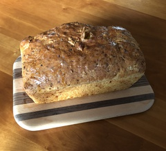

~~~ markdown-script
include '../markdownBookRecipe.mds'
recipeMenu()
~~~

# Dilly Bread

~~~ markdown-script
recipeHeader(objectNew( \
    'author', 'Helen Minkiewitz (Nonny)' \
))
~~~

Soften and mix together and let stand for 10 minutes:

~~~ markdown-script
recipeIngredients(arrayNew( \
    '1 Tbsp dry yeast', \
    '1/4 C lukewarm water', \
    '2 Tbsp  sugar' \
))
~~~

Add and stir in:

~~~ markdown-script
recipeIngredients(arrayNew( \
    '1 C warmed small curd cottage cheese (whole fat cottage cheese is best)', \
    '2 Tbsp minced yellow onion (or 1 Tbsp dehydrated onion)', \
    '1 Tbsp softened butter', \
    '2 tsp dill seed', \
    '1 tsp salt', \
    '1 beaten egg' \
))
~~~

Mix in to form a sticky dough:

~~~ markdown-script
recipeIngredients(arrayNew( \
    '2 1/4 C flour', \
    '1/4 tsp baking soda' \
))
~~~

Turn dough into a greased bowl and allow to rise until double in volume. Stir dough down, place in a
greased loaf pan and allow to rise until double again. Bake at 350 degrees for 40 minutes until loaf
sounds hollow when thumped. Remove from the oven, brush with butter and sprinkle with kosher salt.
Cool in the pan for 15 minutes, then run a knife blade around the edge, and remove from the loaf
pan. Cut the loaf in thick slices and serve hot with butter and lentil soup.
