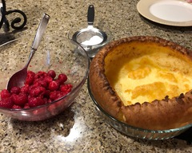

~~~ markdown-script
include '../markdownBookRecipe.bare'
recipeMenu()
~~~

# Dutch Babies

~~~ markdown-script
recipeHeader()
~~~

Dutch babies are made in a glass pie pan or a shallow casserole dish. Select the proportions to fit
the size of pan you are using.

Heat oven to 425 degrees. Put the butter in the pan and set aside while you mix the batter. Place
the eggs (the Baby will have more volume if the eggs and milk are room temperature) in a blender
container and whirl on high speed for 1 minute. Add the milk and blend. Add the flour and process
for 30 seconds. \*

Heat the baking pan with the butter in the oven until the butter melts. Remove the pan from the oven
and pour the batter into the butter. Return the pan to the oven and bake until the pancake is puffed
and brown about 20 minutes. The baby should be cut in wedges and served immediately with you choice
of toppings and a dusting of powdered sugar.

### 2 to 3 qt Pan

~~~ markdown-script
recipeIngredients(arrayNew( \
    '1/3 C butter', \
    '3 eggs', \
    '3/4 C milk', \
    '3/4 C flour' \
))
~~~

### 3 to 4 qt Pan

~~~ markdown-script
recipeIngredients(arrayNew( \
    '1/3 C butter', \
    '4 eggs', \
    '1 C milk', \
    '1 C flour' \
))
~~~

### 4 to 4 1/2 qt Pan

~~~ markdown-script
recipeIngredients(arrayNew( \
    '1/3 C butter', \
    '5 eggs', \
    '1 1/4 C milk', \
    '1 1/4 C flour' \
))
~~~

### 4 1/2 to 5 qt Pan

~~~ markdown-script
recipeIngredients(arrayNew( \
    '1/3 C butter', \
    '6 eggs', \
    '1 1/2 C milk', \
    '1 1/2 C flour' \
))
~~~

Smaller babies seam to work best for me.

Toppings: fresh sliced sweetened strawberries, mixed berries, sauteed apples with sugar and
cinnamon.

Great for a family breakfast or dessert on a winter evening. \** I usually cut the butter in half,
although the butter is delicious.

\* Babies can also be made using rotary mixer: beat the eggs until light and lemon colored, mix in
the milk, blend in the flour to form a batter.
