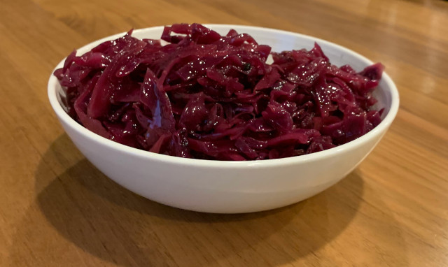

~~~ recipe-info
Title: Hot Cabbage Salad
Author: Emery Hobbs
~~~

Combine in a large saucepan:

~~~ recipe-ingredients
2 C sliced cabbage

1 C diced onion

1/4 C water

2 Tbsp vinegar

1  Tbsp sugar

1 tsp salt
~~~

Cover pan and cook about 20 minutes at low simmer.

Combine with the crisp bacon and serve.

~~~ recipe-ingredients
2 slices crisp cooked diced bacon
~~~

