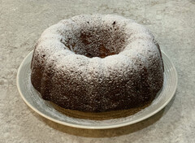

~~~ markdown-script
include '../markdownBookRecipe.mds'
recipeMenu()
~~~

# Hummingbird Cake

~~~ markdown-script
recipeHeader('Vicki Bessa')
~~~

Mix together in a large bowl:

~~~ markdown-script
recipeIngredients( \
    '3 C flour', \
    '1 tsp baking soda', \
    '1 tsp salt', \
    '2 C sugar', \
    '1 C chopped pecans', \
    '3/4 tsp ground cinnamon' \
)
~~~

Mix together in a quart measuring cup:

~~~ markdown-script
recipeIngredients( \
    '1 1/2 C vegetable oil', \
    '3 large eggs', \
    '1 8 oz can crushed pineapple in its own juice (undrained)', \
    '1 Tbsp very soft butter' \
)
~~~

Add the wet ingredients all at once to the dry ingredients, blend together BY HAND just until mixed.
Fold in chopped ripe bananas lightly.

~~~ markdown-script
recipeIngredients( \
    '2 small ripe bananas, chopped' \
)
~~~

Turn batter into a tube (angel food cake pan) or bundt pan which has been greased and dusted with
flour. Bake at 350 degrees for 65 minutes. Coo! the cake in the pan for at least one hour and turn
upside down on a cake plate. Dust with powdered sugar and serve with whipped cream.

The flavor of this cake is better the second day. This cake is great for breakfast, too.
