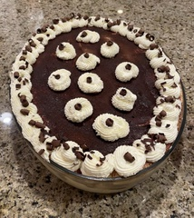

~~~ markdown-script
include '../markdownBookRecipe.bare'
recipeMenu()
~~~

# Tiramisu

~~~ markdown-script
recipeHeader({'servings': 12})
~~~

Use the recipe for
[Cream Roll](#url=CreamCakeRoll.md&var.vCategory='Desserts'&var.vScale=1.5),
except increase by 1/2 and bake as directed in an 18' X 13" sheet pan. Cool cake in the pan. Lift the cake out with the
foil liner and slice in 4 pieces across the short side. Can be done 1 day ahead. Do not cover cake.

### Filling

Whisk together in a large metal mixing bowl over boiling water:

~~~ markdown-script
recipeIngredients([ \
    '14 egg yolks', \
    '1 C sugar', \
    '2/3 C marsala' \
])
~~~

Whisk and cook this Zabaglione until doubled in volume and thick. Remove from the heat and add the
mascarpone at room temperature and stir until completely blended. Cool completely.

~~~ markdown-script
recipeIngredients([ \
    '16 oz mascarpone' \
])
~~~

Beat the heavy cream and the sugar until fairly firm. Fold the whipped cream into the chilled
Zabaglione. Chill again to firm up.

~~~ markdown-script
recipeIngredients([ \
    '2 C heavy cream', \
    '1/4 C sugar' \
])
~~~

Combine in a large measuring cup and microwave and stir together until chocolate has melted:

~~~ markdown-script
recipeIngredients([ \
    '1 C 2 shots espresso diluted to 1 cup (or strong coffee)', \
    '1 tsp vanilla', \
    '1/4 C rum', \
    '2 Tbsp marsala', \
    '2 Tbsp kahlua', \
    '1 oz good semisweet chocolate' \
])
~~~

Assemble the tiramisu. Slice the cake (recipe attached) and fit into a 15" X 10" X 2 1/2" serving
dish. Brush the cake liberally with the coffee mixture, spread with 1/2 of the cream mixture and
sift with the Ghiardelli sweet ground chocolate and cocoa (in the baking section of most grocery
stores).

~~~ markdown-script
recipeIngredients([ \
    '3 Tbsp  Ghiardelli sweet ground chocolate and cocoa' \
])
~~~

Repeat, ending with the sprinkled sweet chocolate (you may not use all of the cake). Pipe the top of
the tiramisu with sweetened whipped cream and sprinkle piping with shaved semisweet chocolate.
Refrigerate until ready to serve.

\* This is Dad's favorite dessert. When we returned from Italy, we tried to duplicate the wonderful
tiramisu that we'd had. I think we looked at about 30 different recipes, tried about 10 of those,
then tweaked the best to taste like what we remembered. This dessert is

Best made a day ahead. I only make this once a year for Dad's birthday (Aug. 9).
